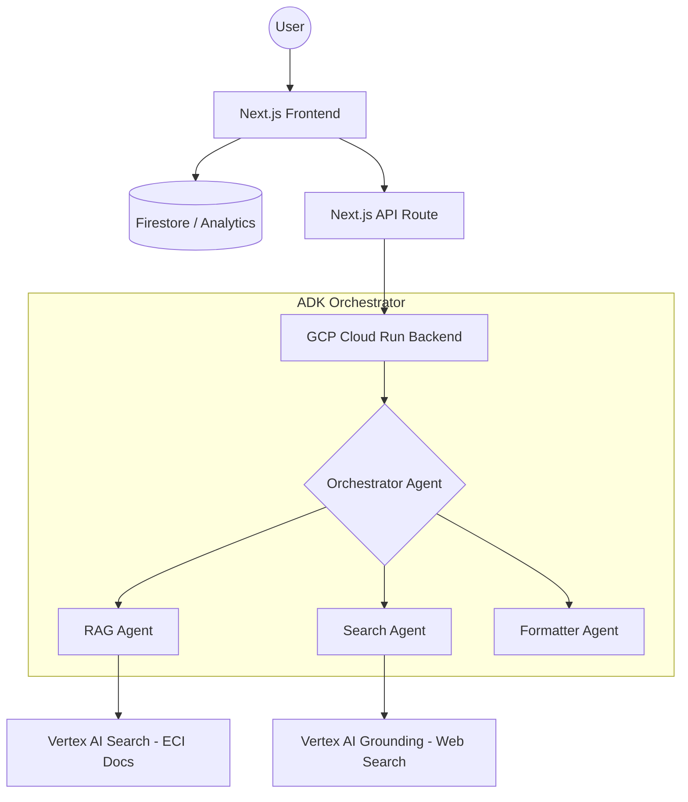

# 🗳️ VotePilot AI — Your Neutral Election Companion

[](https://opensource.org/licenses/MIT)
[](https://nextjs.org/)
[](https://cloud.google.com/vertex-ai)
[](https://firebase.google.com/)

**VotePilot AI** is a state-of-the-art, neutral election education platform built for the **Hack2skill PromptWars** hackathon. It leverages Google's **Vertex AI** and the **Agent Development Kit (ADK)** to provide citizens with accurate, grounded, and personalized information about the electoral process in India.

---

## 🚀 Live Demo
- **Frontend:** [votepilot-frontend.run.app](https://votepilot-frontend-74810085857.asia-south1.run.app)
- **Backend API:** [votepilot-backend.run.app](https://votepilot-backend-74810085857.asia-south1.run.app)

---

## ✨ Key Features

### 🧠 Multi-Agent RAG Pipeline ("Ask VotePilot")
A sophisticated backend powered by 4 specialized agents:
- **RAG Agent:** Retrieves information from official Election Commission of India (ECI) documents.
- **Search Agent:** Uses Vertex AI grounding with Google Search for live election updates.
- **Formatter Agent:** Adapts responses for 3 "Explain Levels" (Simple, Standard, Detailed) and 3 languages.
- **Orchestrator:** Intelligently routes queries to ensure high-accuracy, source-verified answers.

### 🎮 Booth Day Simulator
An interactive, state-machine based simulator that walks users through the exact steps of voting at a polling station—handling branches like "Wrong Booth", "No ID", or "Confusion with EVM".

### 📊 Voter Readiness Score
A gamified dashboard featuring a "Readiness Ring" that tracks your preparation progress based on onboarding, simulator completion, and myth-busting activity.

### 🚩 Myth Buster
A dedicated section to debunk common election misinformation, with facts grounded in official ECI documentation.

### 🌐 Multilingual Support
Built-in support for **English**, **Hindi**, and **Assamese**, ensuring accessibility for a diverse electorate.

---

## 🛠️ Tech Stack

| Layer | Technologies |
| :--- | :--- |
| **Frontend** | Next.js 14 (App Router), Tailwind CSS, Lucide React |
| **Backend** | Python (FastAPI), Google Cloud Run |
| **AI Engine** | Gemini 2.0 Flash, Vertex AI Search & Grounding |
| **Framework** | Google Agent Development Kit (ADK) |
| **Persistence** | Firebase Firestore |
| **Analytics** | Firebase Analytics |
| **Deployment** | Google Cloud Platform (GCP) |

---

## 🏗️ Architecture



---

## 🏃 Getting Started

### Prerequisites
- Node.js 18+
- Python 3.9+
- Google Cloud Project with Vertex AI enabled
- Firebase Project

### Local Development

#### 1. Clone the repository
```bash
git clone https://github.com/prabaaal/VotePilot-AI.git
cd VotePilot-AI
```

#### 2. Frontend Setup
```bash
# Install dependencies
npm install

# Create .env.local and add your Firebase/GCP credentials
cp .env.local.example .env.local

# Run the dev server
npm run dev
```

#### 3. Backend Setup
```bash
cd backend
# Create virtual environment
python -m venv venv
source venv/bin/activate

# Install dependencies
pip install -r requirements.txt

# Run the FastAPI server
python main.py
```

---

---

## 🧪 Testing & Quality Assurance

VotePilot AI maintains a high standard of code quality with comprehensive test coverage for both frontend and backend.

### Frontend (Jest + React Testing Library)
**35 tests passed** across 6 specialized suites:
- **Recommendation Engine:** Validates personalized voter guidance logic.
- **Simulator State Machine:** Ensures integrity of the interactive voting flow.
- **API Routes:** Mocks backend communication and validates error handling.
- **UI Components:** Verifies accessibility and rendering of critical components like `ReadinessRing` and `ChecklistItem`.

```bash
npm test
```

### Backend (Pytest)
**17 tests passed** covering core agent logic and infrastructure:
- **Config Validation:** Ensures all GCP and Vertex AI parameters are correctly set.
- **Formatter Agent:** Tests structured JSON response generation and language support.
- **RAG Agent:** Validates Discovery Engine integration and context retrieval.
- **FastAPI Routes:** Verifies health status and endpoint reachability.

```bash
cd backend && pytest
```

---

## 📂 Project Structure

- `/app`: Next.js pages and API routes.
- `/backend`: Python ADK backend.
  - `/agents`: Specialized agent implementations (RAG, Search, Formatter).
  - `/tests`: Pytest suite for backend verification.
- `/__tests__`: Jest test suite for frontend and logic.
- `/components`: Reusable UI components.
- `/lib`: Shared logic (Firebase, Recommendation Engine).
- `/data`: Static configuration and simulator state.

---

## 🤝 Acknowledgments
- **Google DeepMind** for providing the Vertex AI and Gemini infrastructure.
- **Hack2skill** for organizing the PromptWars challenge.

---
Built with ❤️ by [Prabal](https://github.com/prabaaal)
